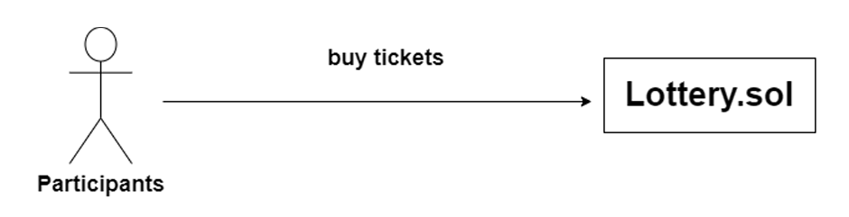

# PlayWin

Playwin is a transparent blockchain-based gaming platform where users can play raffles and lotteries. Furthermore, users can earn FUSDT tokens pegged to USDT by staking USDT.

**There are 4 main smart contracts as follows;**

**1. FUSDT.sol (ERC20)**

FUSDT is an ERC20-based token designed for playing raffle and lottery games on the platform. Essentially, FUSDT serves as the primary currency within this ecosystem. Moreover, FUSDT maintains a fixed value tied to USDT by being backed by USDT. This means that 1 FUSDT is always equal in value to 1 USDT.

**2. Staking.sol**

The staking smart contract allows users to deposit USDT and, in return, earn FUSDT as rewards. These rewards are generated from the total sales of raffle and lottery tickets, distributed at the conclusion of each lottery round. Furthermore, the USDT staked by users is reinvested into the AAVE V3 POOL to accrue additional rewards for the platform.

**3. Raffle.sol**

A raffle allows users to either create their own or join existing ones. The creator earns FUSDT from total sales, while the winner, selected from the participants, receives a prize.

To initiate a raffle, a deposit of 10 FUSDT is required.

During a successful raffle, 90% of the total sales proceeds are distributed among the raffle creator, a reward vault, and the platform's team vault. The remaining 10% constitutes the prize awarded to the winner. Conversely, if a raffle fails, typically due to the creator setting a high minimum entry requirement, 95% of the deposit is returned to the creator, with 2.5% each allocated to the reward vault and team vault. In this scenario, the prize is returned to the creator.

Raffles are executed at the specified end time set by the creator using Upkeep and VRF, supported by Chainlink.

**4. Lottery.sol**

The lottery feature allows users to purchase tickets by selecting five numbers.

Each round of the lottery lasts for 42,600 blocks, approximately equivalent to 23 hours and 50 minutes. Following this period, the winning numbers are revealed, and the first, second, and third-place winners are determined within a 10-minute window.

Once a round concludes, 70% of the total sales proceeds are allocated to a claimVault for the lottery, 20% to a rewardVault for staking, and 10% to the teamVault for the platform's operations.

The first-place prize is supported by a predetermined amount of FUSDT contributed by the team, along with 10% of the total sales distributed to the claimVault. The second and third-place prizes are 60% and 30% of the total sales distributed to the claimVault, respectively. In the event that there are no winners in any category, the prize amount carries over to the next round.

The winning numbers are generated using Chainlink's VRF, and the results, including the number of winners, are transferred to the lottery.sol contract via the backend hosted on the Oracle Cloud.

**Raffle**

**1. Create a raffle**

As shown in the image above, users can create raffles with a 10 FUSDT deposit fee and send a prize. The prize and deposit fee will be stored in the raffle vault. Only ERC20, ERC721 and ERC1155 are available as prizes. Furthermore, users can set up more detail feature of their raffles as follows

- The minimum number of entries: the minimum number of entries required for
  a raffle to proceed. If the minimum number is not met, the prize and deposit will be returned to the creator.
- The maximum number of entries: the maximum number of entries that users can join in the raffle.
- The minimum number of entries per user: the minimum number of entries that each user can purchase in the raffle.
- The maximum number of entries per user: the maximum number of entries that each user can purchase in the raffle.
- Price: the price of each raffle entry.
- Date: the deadline for the raffle to end.

**2. Join a raffle**

User can buy raffle tickets as many as the maximum number of entries per user, by paying FUSDT.

**3. Draw a raffle winner**

After the raffle deadline passes, UpKeep, supported by Chainlink, will request VRF to generate a random number. This random number will be used to determine the winner. Once the winner is selected, the prize will be sent to the winner.

90% of the total sales and the initial deposit made by users to create the raffle will be transferred to the raffle creator. The remaining 5% each of the total sales will be allocated to the reward vault for rewarding staking users and the team vault for platform operations.

**4. Cancel a raffle**

If the total number of entries for a raffle does not meet the minimum set by the creator, the raffle can be canceled. In such cases, UpKeep will assist in returning the prize and 95% of the deposit to the participants who entered the raffle. The remaining 2.5% each of the total sales will be allocated to the reward vault for rewarding staking users and the team vault for platform operations

**Lottery**

**1. Buy lottery tickets**

Users can buy lottery tickets, input any 5 numbers by paying FUSDT.

**2. Announce Winning numbers**

Every 42,600 blocks, each round of the lottery will end, and the winning number will
be generated by Chainlink's VRF. Once the random number is generated, the first,
second, and third-place winners will be computed on the server-side hosted on the
Oracle Cloud. Afterward, the computed data will be sent to Lottery.sol so that winners
can claim their prizes accurately.

As shown in the image above, 70%, 20%, and 10% of total sales will be split into the
claim vault for the lottery, the reward vault for staking users, and the team vault
for the platform.

The first-place prize is supported by a predetermined amount of FUSDT contributed by
the team, along with 10% of the total sales distributed to the claim vault. The second
and third-place prizes are 60% and 30% of the total sales distributed to the claim
vault, respectively. In the event that there are no winners in any category, the prize
amount carries over to the next round.

**3. Claim prizes**

Winners can claim prizes within 7 rounds, otherwise the prize will be gone.
Once a winner executed claim function in Lottery.sol, the prizeVault.sol will send the prize in FUSDT to the winner.

**DEMO Link**

**playwin** : [https://playwin-on-blockchain.netlify.app/]

--
**TEST**

I have made total 170 test case.

Go to Smart Contract

npm i

npx hardhat test

---

**CONTRACT**

**FUSDT** : 0x7aEcf9c9C656aC4044833B1387248ef2ed4579A3
[https://sepolia.etherscan.io/address/0x7aEcf9c9C656aC4044833B1387248ef2ed4579A3#code]

**ClaimVault** : 0x648d987eBcA35883ddBCF518cb98A1d7d06F640D
[https://sepolia.etherscan.io/address/0x648d987eBcA35883ddBCF518cb98A1d7d06F640D#code]

**RewardVault** : 0xfE7e695790c6c004435362eBb2749c03BB72ACeF
[https://sepolia.etherscan.io/address/0xfE7e695790c6c004435362eBb2749c03BB72ACeF#code]

**TeamVault** : 0xac4Fbf6E6695DB522DDE41735318B4553B05aeb8
[https://sepolia.etherscan.io/address/0xac4Fbf6E6695DB522DDE41735318B4553B05aeb8#code]

**RaffleVault** : 0x650FAB7D8d5F050aab057a7536eD9A6f5AAd00de
[https://sepolia.etherscan.io/address/0x650FAB7D8d5F050aab057a7536eD9A6f5AAd00de#code]

**FirstPlacePrizeVault** : 0xf1764b91D0b0dC9970E17339dCE8386ef0337889
[https://sepolia.etherscan.io/address/0xf1764b91D0b0dC9970E17339dCE8386ef0337889#code]

**ERC20Prize(TEST-PRIZE)** : 0xBE2637940e5eF970e7835CDC5124650ef36d0060
[https://sepolia.etherscan.io/address/0xBE2637940e5eF970e7835CDC5124650ef36d0060#code]

**ERC721Prize(TEST-PRIZE)** : 0x0c1C4c73E4A94B559a1502c57176887550A4cf5A
[https://sepolia.etherscan.io/address/0x0c1C4c73E4A94B559a1502c57176887550A4cf5A#code]

**ERC1155Prize(TEST-PRIZE)** : 0x8FA15CbFCf5017B8E829f3368793819c00dA456C
[https://sepolia.etherscan.io/address/0x8FA15CbFCf5017B8E829f3368793819c00dA456C#code]

**Lottery** : 0x104bE76855bC2Bb1748B41A9E97061A4c053F35f
[https://sepolia.etherscan.io/address/0x104bE76855bC2Bb1748B41A9E97061A4c053F35f#code]

**Raffle** : 0x0423E6a9EFdE2c4e65bD062071D2dB5ed9986ffD
[https://sepolia.etherscan.io/address/0x0423E6a9EFdE2c4e65bD062071D2dB5ed9986ffD#code]

**RaffleUpKeep** : 0xc380d307a0d5081F72d8D0cD91FecDaB99ad63FE
[https://sepolia.etherscan.io/address/0xc380d307a0d5081F72d8D0cD91FecDaB99ad63FE#code]

**Staking** : 0x48E33Ae4c6F00511bdF4A8AFBF93D5D051ddCBFd
[https://sepolia.etherscan.io/address/0x48E33Ae4c6F00511bdF4A8AFBF93D5D051ddCBFd#code]

**ChainLinkRegister** : 0xbf7bc4bbdd7c77E7d116A2E685f4D6C7AfA30c45
[https://sepolia.etherscan.io/address/0xbf7bc4bbdd7c77E7d116A2E685f4D6C7AfA30c45#code]

**VRF** : 0xca443cc4185537B4b1BaC1020568bb5FB9c46C52
[https://sepolia.etherscan.io/address/0xca443cc4185537B4b1BaC1020568bb5FB9c46C52#code]
